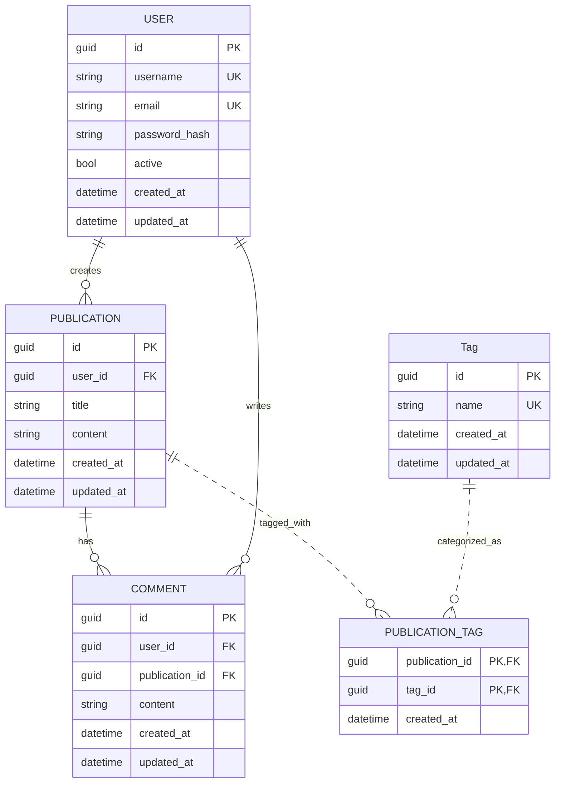

# Prueba Tecnica Jikkosoft

## Puntos a desarrollar:
1. Diseñar un esquema de base de datos para una plataforma de blogs
**sencilla**. La plataforma debe admitir usuarios, publicaciones de blog,
comentarios y etiquetas.

2. Escribe una función en lenguaje de su preferencia que tome una lista de
enteros y un entero de destino, y devuelva los índices de los dos números
que sumados dan el resultado del entero destino.

3. Diseñe e implemente un sistema de gestión de bibliotecas sencillo con
clases para libros, bibliotecas y miembros.

## Desarrollo #1:

### Diagrama Entidad Relación


### Scripts de creación de tablas - SQL Server

#### User
```sql
CREATE TABLE [user] (
	id uniqueidentifier NOT NULL PRIMARY KEY,
	username varchar(50) NOT NULL UNIQUE,
	email varchar(100) NOT NULL UNIQUE,
	password_hash varchar(255) NOT NULL,
	active bit NOT NULL DEFAULT(1),
	created_at datetime NOT NULL,
	updated_at datetime NOT NULL
)
```

### Publication
```sql
CREATE TABLE [publication] (
	id uniqueidentifier NOT NULL PRIMARY KEY,
	user_id uniqueidentifier NOT NULL FOREIGN KEY REFERENCES [user](id),
	title varchar(200) NOT NULL,
	content text NOT NULL,
	created_at datetime NOT NULL,
	updated_at datetime NOT NULL
)
```

### Comment
```sql
CREATE TABLE [comment] (
	id UNIQUEIDENTIFIER NOT NULL PRIMARY KEY,
	user_id uniqueidentifier NOT NULL FOREIGN KEY REFERENCES [user](id),
	publication_id uniqueidentifier NOT NULL FOREIGN KEY REFERENCES [publication](id),
	content text NOT NULL,
	created_at datetime NOT NULL,
	updated_at datetime NOT NULL
)
```

### Tag
```sql
CREATE TABLE [tag] (
	id UNIQUEIDENTIFIER NOT NULL PRIMARY KEY,
	name varchar(50) NOT NULL UNIQUE,
	created_at datetime NOT NULL,
	updated_at datetime NOT NULL
)
```

### Publication_Tag
```sql
CREATE TABLE [publication_tag] (
	publication_id uniqueidentifier NOT NULL FOREIGN KEY REFERENCES [publication](id),
	tag_id uniqueidentifier NOT NULL FOREIGN KEY REFERENCES tag(id),
	created_at datetime NOT NULL,
)
```