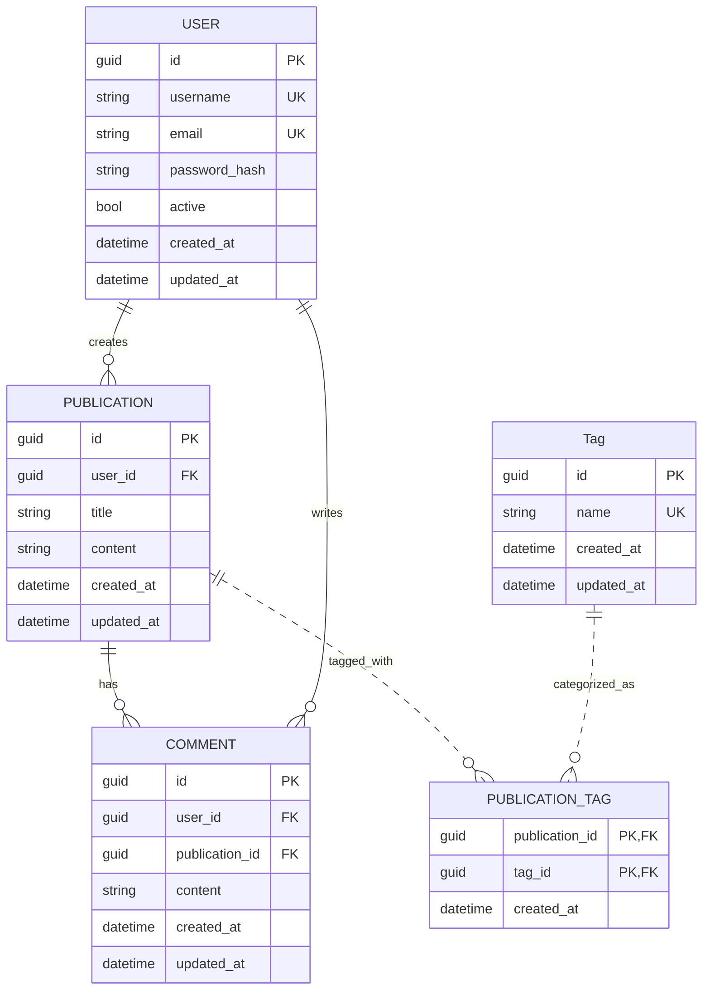
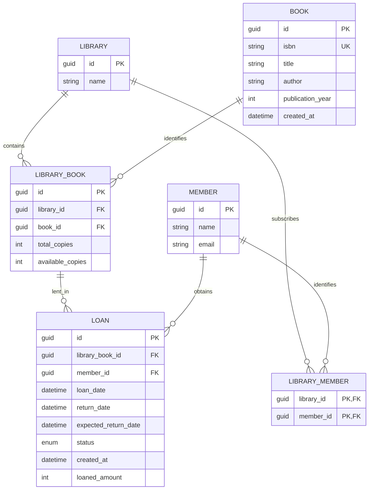

# Prueba Tecnica Jikkosoft

## Puntos a desarrollar:

1. Diseñar un esquema de base de datos para una plataforma de blogs
**sencilla**. La plataforma debe admitir usuarios, publicaciones de blog,
comentarios y etiquetas.

2. Escribe una función en lenguaje de su preferencia que tome una lista de
enteros y un entero de destino, y devuelva los índices de los dos números
que sumados dan el resultado del entero destino.

3. Diseñe e implemente un sistema de gestión de bibliotecas sencillo con
clases para libros, bibliotecas y miembros.

## Desarrollo #1

### Diagrama Entidad Relación



### Scripts de creación de tablas - SQL Server

#### User

```sql
CREATE TABLE [user] (
	id uniqueidentifier NOT NULL PRIMARY KEY,
	username varchar(50) NOT NULL UNIQUE,
	email varchar(100) NOT NULL UNIQUE,
	password_hash varchar(255) NOT NULL,
	active bit NOT NULL DEFAULT(1),
	created_at datetime NOT NULL,
	updated_at datetime NOT NULL
)
```

### Publication

```sql
CREATE TABLE [publication] (
	id uniqueidentifier NOT NULL PRIMARY KEY,
	user_id uniqueidentifier NOT NULL FOREIGN KEY REFERENCES [user](id),
	title varchar(200) NOT NULL,
	content text NOT NULL,
	created_at datetime NOT NULL,
	updated_at datetime NOT NULL
)
```

### Comment

```sql
CREATE TABLE [comment] (
	id UNIQUEIDENTIFIER NOT NULL PRIMARY KEY,
	user_id uniqueidentifier NOT NULL FOREIGN KEY REFERENCES [user](id),
	publication_id uniqueidentifier NOT NULL FOREIGN KEY REFERENCES [publication](id),
	content text NOT NULL,
	created_at datetime NOT NULL,
	updated_at datetime NOT NULL
)
```

### Tag

```sql
CREATE TABLE [tag] (
	id UNIQUEIDENTIFIER NOT NULL PRIMARY KEY,
	name varchar(50) NOT NULL UNIQUE,
	created_at datetime NOT NULL,
	updated_at datetime NOT NULL
)
```

### Publication_Tag

```sql
CREATE TABLE [publication_tag] (
	publication_id uniqueidentifier NOT NULL FOREIGN KEY REFERENCES [publication](id),
	tag_id uniqueidentifier NOT NULL FOREIGN KEY REFERENCES tag(id),
	created_at datetime NOT NULL,
)
```

## Desarrollo #2

Se creó un proyecto llamado **Desarrollo 2.csproj** que contiene en **Program.cs** la función solicitada.

### Código de la función C\#

```c#
/// <summary>
/// Función que devuelve los índices de dos números enteros en una lista que suman un número destino.
/// </summary>
/// <param name="sourceNumbers">Lista de números enteros,</param>
/// <param name="destNumber">Número entero que debe ser el resultado de los dos números de la lista</param>
/// <returns>Tupla con los índices de los números que suman el valor de destino, o null si no se encuentran.</returns>
static (int, int)? GetIndexes(IEnumerable<int> sourceNumbers, int destNumber)
{
    Dictionary<int, int>? map = [];

    int index = 0;
    foreach (var currentNumber in sourceNumbers)
    {
        int neededNumber = destNumber - currentNumber;

        if (map.TryGetValue(neededNumber, out int existingIndex))
        {
            return (existingIndex, index);
        }

        map[currentNumber] = index;
        index++;
    }

    return null;
}
```

## Desarrollo #3

### Diagrama de Entidad Relación




### Características Principales

- **API RESTful** completa con documentación Swagger
- **Clean Architecture** con separación clara de responsabilidades
- **CQRS Pattern** con MediatR para comandos y consultas
- **Entity Framework Core** con SQL Server
- **Health Checks** integrados
- **Containerización** completa con Docker
- **Manejo de excepciones** centralizado
- **Validación** de datos con FluentValidation
- **Caching** en memoria para optimización

### Arquitectura del Sistema

```
LibraryManager/
├── LibraryManager/                 # Presentation Layer (Web API)
│   ├── Controllers/                   # API Controllers
│   ├── Middleware/                    # Custom Middleware
│   └── Extensions/                    # Application Extensions
├── LibraryManager.Application/     # Application Layer
│   ├── Commands/                      # CQRS Commands
│   ├── Abstractions/                  # Application Interfaces
│   └── Exceptions/                    # Application Exceptions
├── LibraryManager.Domain/          # Domain Layer
│   ├── Entities/                      # Domain Entities
│   ├── Abstractions/                  # Domain Interfaces
│   └── Responses/                     # Response Models
├── LibraryManager.Infrastructure/  # Infrastructure Layer
│   ├── Repositories/                  # Data Access
│   ├── Configurations/               # EF Configurations
│   ├── Migrations/                   # Database Migrations
│   └── Caching/                      # Cache Implementation
└── docker/                        # Docker Configuration
    ├── docker-compose.yml            # Container Orchestration
    └── init/                         # Database Init Scripts
```

### Endpoints API Disponibles

#### Libros (`/api/Book`)
```http
GET    /api/Book              # Obtener libros paginados
GET    /api/Book/{id}         # Obtener libro por ID
POST   /api/Book              # Crear nuevo libro
PATCH  /api/Book/{id}         # Actualizar libro
DELETE /api/Book/{id}         # Eliminar libro
```

#### Bibliotecas (`/api/Library`)
```http
GET    /api/Library           # Obtener bibliotecas paginadas
GET    /api/Library/{id}      # Obtener biblioteca por ID
POST   /api/Library           # Crear nueva biblioteca
PATCH  /api/Library/{id}      # Actualizar biblioteca
DELETE /api/Library/{id}      # Eliminar biblioteca
```

#### Miembros (`/api/Member`)
```http
GET    /api/Member            # Obtener miembros paginados
GET    /api/Member/{id}       # Obtener miembro por ID
POST   /api/Member            # Crear nuevo miembro
PATCH  /api/Member/{id}       # Actualizar miembro
DELETE /api/Member/{id}       # Eliminar miembro
```

#### Préstamos (`/api/Loan`)
```http
GET    /api/Loan              # Obtener préstamos paginados
GET    /api/Loan/{id}         # Obtener préstamo por ID
POST   /api/Loan              # Crear nuevo préstamo
PATCH  /api/Loan/return/{id}  # Devolver libro
DELETE /api/Loan/{id}         # Cancelar préstamo
```

#### Biblioteca-Libros (`/api/LibraryBook`)
```http
GET    /api/LibraryBook       # Obtener inventario paginado
GET    /api/LibraryBook/{id}  # Obtener registro por ID
POST   /api/LibraryBook       # Agregar libro a biblioteca
PATCH  /api/LibraryBook/{id}  # Actualizar inventario
DELETE /api/LibraryBook/{id}  # Remover libro de biblioteca
```