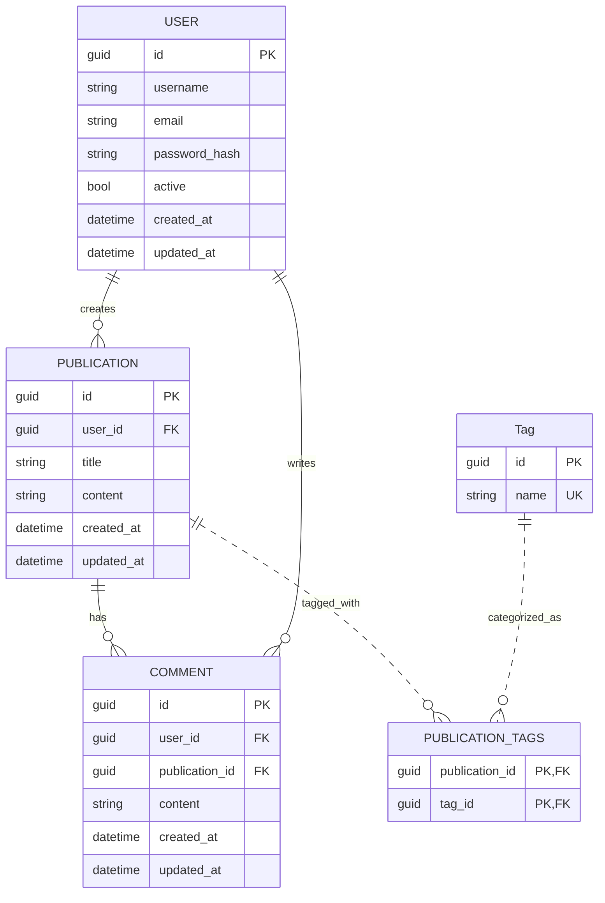

# PruebaTecnicaJikkosoft

## Puntos a desarrollar:
1. Diseñar un esquema de base de datos para una plataforma de blogs
**sencilla**. La plataforma debe admitir usuarios, publicaciones de blog,
comentarios y etiquetas.

2. Escribe una función en lenguaje de su preferencia que tome una lista de
enteros y un entero de destino, y devuelva los índices de los dos números
que sumados dan el resultado del entero destino.

3. Diseñe e implemente un sistema de gestión de bibliotecas sencillo con
clases para libros, bibliotecas y miembros.

## Desarrollo #1:

### Diagrama Entidad Relación

