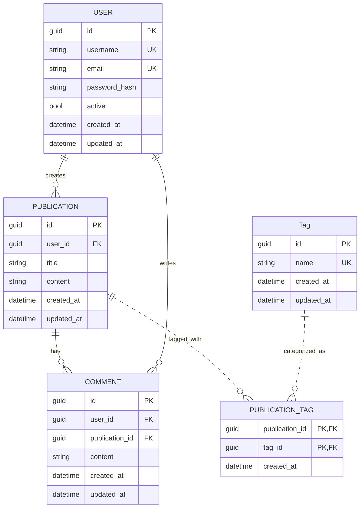
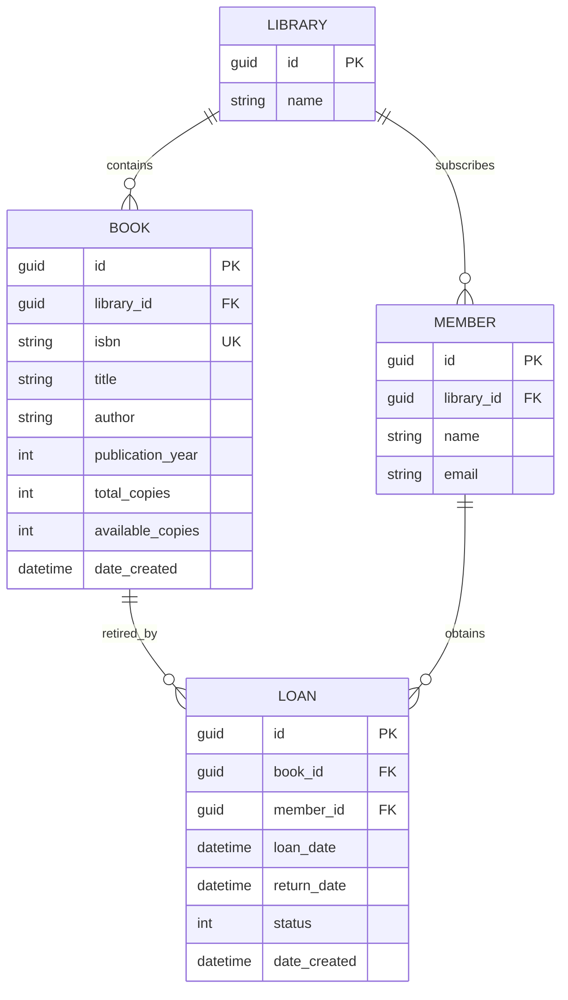

# Prueba Tecnica Jikkosoft

## Puntos a desarrollar:
1. Diseñar un esquema de base de datos para una plataforma de blogs
**sencilla**. La plataforma debe admitir usuarios, publicaciones de blog,
comentarios y etiquetas.

2. Escribe una función en lenguaje de su preferencia que tome una lista de
enteros y un entero de destino, y devuelva los índices de los dos números
que sumados dan el resultado del entero destino.

3. Diseñe e implemente un sistema de gestión de bibliotecas sencillo con
clases para libros, bibliotecas y miembros.

## Desarrollo #1:

### Diagrama Entidad Relación


### Scripts de creación de tablas - SQL Server

#### User
```sql
CREATE TABLE [user] (
	id uniqueidentifier NOT NULL PRIMARY KEY,
	username varchar(50) NOT NULL UNIQUE,
	email varchar(100) NOT NULL UNIQUE,
	password_hash varchar(255) NOT NULL,
	active bit NOT NULL DEFAULT(1),
	created_at datetime NOT NULL,
	updated_at datetime NOT NULL
)
```

### Publication
```sql
CREATE TABLE [publication] (
	id uniqueidentifier NOT NULL PRIMARY KEY,
	user_id uniqueidentifier NOT NULL FOREIGN KEY REFERENCES [user](id),
	title varchar(200) NOT NULL,
	content text NOT NULL,
	created_at datetime NOT NULL,
	updated_at datetime NOT NULL
)
```

### Comment
```sql
CREATE TABLE [comment] (
	id UNIQUEIDENTIFIER NOT NULL PRIMARY KEY,
	user_id uniqueidentifier NOT NULL FOREIGN KEY REFERENCES [user](id),
	publication_id uniqueidentifier NOT NULL FOREIGN KEY REFERENCES [publication](id),
	content text NOT NULL,
	created_at datetime NOT NULL,
	updated_at datetime NOT NULL
)
```

### Tag
```sql
CREATE TABLE [tag] (
	id UNIQUEIDENTIFIER NOT NULL PRIMARY KEY,
	name varchar(50) NOT NULL UNIQUE,
	created_at datetime NOT NULL,
	updated_at datetime NOT NULL
)
```

### Publication_Tag
```sql
CREATE TABLE [publication_tag] (
	publication_id uniqueidentifier NOT NULL FOREIGN KEY REFERENCES [publication](id),
	tag_id uniqueidentifier NOT NULL FOREIGN KEY REFERENCES tag(id),
	created_at datetime NOT NULL,
)
```


## Desarrollo #2

Se creó un proyecto llamado **Desarrollo 2.csproj** que contiene en **Program.cs** la función solicitada.

### Código de la función C#
```c#
/// <summary>
/// Función que devuelve los índices de dos números enteros en una lista que suman un número destino.
/// </summary>
/// <param name="sourceNumbers">Lista de números enteros,</param>
/// <param name="destNumber">Número entero que debe ser el resultado de los dos números de la lista</param>
/// <returns>Tupla con los índices de los números que suman el valor de destino, o null si no se encuentran.</returns>
static (int, int)? GetIndexes(IEnumerable<int> sourceNumbers, int destNumber)
{
    Dictionary<int, int>? map = [];

    int index = 0;
    foreach (var currentNumber in sourceNumbers)
    {
        int neededNumber = destNumber - currentNumber;

        if (map.TryGetValue(neededNumber, out int existingIndex))
        {
            return (existingIndex, index);
        }

        map[currentNumber] = index;
        index++;
    }

    return null;
}
```

## Desarrollo #3

Para mantener la simplicidad de la solucón se optó por definir que cada edición de libro sólo pueda pertenecer a una biblioteca; igualmente para los miembros, estos solo pueden estar suscritos a una biblioteca.

### Diagrama de Entidad Relación.

